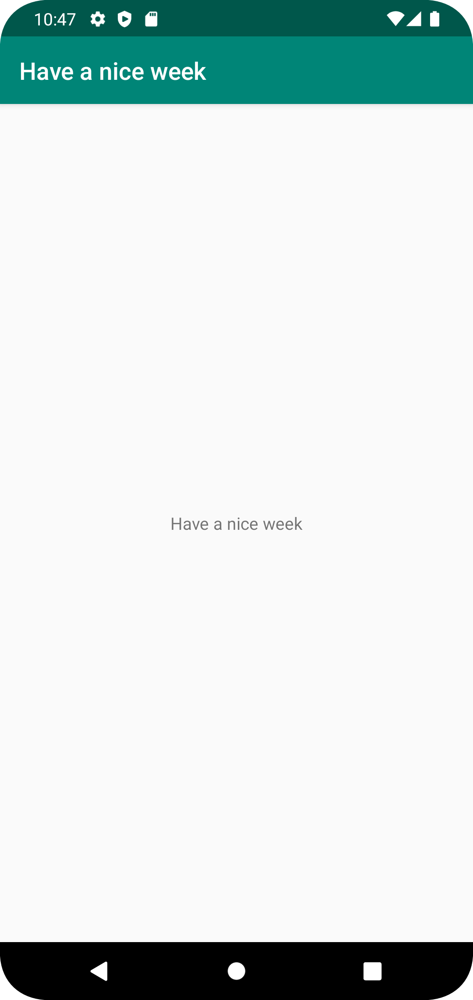

# Rapport a22isahe
Projektet forkades till min repository på Github.com. Projektet klonades och startades i android studio. I android stuido loggades jag in med gitthub kontot.
I res/values/strings.xml ändrades strängen "app_name" till Have a nice week vilket gör att programmet skriver ut Strängen med uppdaterad text på skärmen.
Koden som ändrades finns nedan:
```
<resources>
    // changed Text to Have a nice Week
    <string name="app_name">Have a nice week</string>
</resources>
```
När koden körs på virtuella enheten skrivs texten ut som på bilden:


Därefter commitades koden och pushades till min repositiory på github.
ett test gjordes där den senaste commiten klonades för att se att allt sparats.
